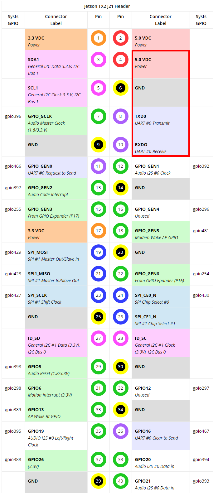

# Аппаратная платформа

## Соединительная плата
Для управления двигателями можно было бы использовать встроенное GPIO Jetson, но используется вспомогательная плата на STM32 Blue Pill, которая принимает команды по UART и управляет драйвером двигателя.

- [Принципиальная схема](docs/Connection-board-schematics.png)
- [Печатная плата](docs/Connection-board-pcb.png) / [для печати](docs/Connection-board-pcb-black.png)


## Распиновка драйвера двигателя


## Подключение к NVidia Jetson
Пины для подключения переходной платы отмечены красным. Этот UART обозначен в системе как `/dev/ttyS0`.



## Формат команд
Переходная плата управляется командами следующего вида:

```
0x34 0x27 0x77 <left> <right>
```
`left`, `right` - скорость двигателей в дипазоне от -128 (полный назад) до 127 (полный вперед). Значение указывет скважность ШИМ. 