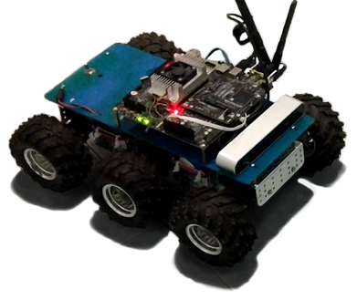

# jetson_car
Набор разного ПО для экспериментов с моделью беспилотного автомобиля

## Реализовано
 - управление двигателями платформы с помощью NVidia Jetson
 - удаленное телеуправление с помощью джойстика (клиент под ROS и Windows)
 - экспериментальное движение по заданной траектории

## Аппаратная платформа
- Платформа: 6-колесная мобильная платформа от Pololu
- Бортовой компьютер: NVidia Jetson TX2
- ZED camera
- Драйвер двигателей: Pololu md03a
- STM32F103C8T6 для связи NVidia Jetson с драйвером

[Подробнее об аппаратной платформе](HARDWARE.md)

## Состав репозитория
### RCWin32
Программа для телеуправления с помощью джойстика для Windows (.NET Framework). На текущий момент пока не поддерживается ROS-пакетом.

## stm32_firmware
Прошивка для микроконтроллера соединительной платы

## jetson_car
Пакет ROS с основной функциональностью. Пакет общий и для NVidia Jetson, и для ПК оператора, чтобы можно было выбирать, где запускать какие компоненты. 

[Подробнее о пакете jetson_car](jetson_car/README.md)