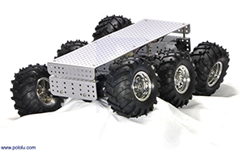

# ros_car
Набор разного ПО для модели беспилотного автомобиля 

## Аппаратная платформа
- Платформа: 6-колесная мобильная платформа от Pololu
- Бортовой компьютер: NVidia Jetson TX2
- Драйвер двигателей: Pololu md03a
- STM32F103C8T6 для связи NVidia Jetson с драйвером



### Соединительная плата
Для управления двигателями можно было бы использовать встроенное GPIO Jetson, но используется вспомогательная плата на STM32 Blue Pill, которая принимает команды по UART и управляет драйвером двигателя.

- [Принципиальная схема](hardware/Connection-board-schematics.png)
- [Печатная плата](hardware/Connection-board-pcb.png) / [для печати](hardware/Connection-board-pcb-black.png)


### Распиновка драйвера двигателя


### Подключение к NVidia Jetson
Для подключения используется UART, выведенный на разъем J21. [Распиновка разъема J21](hardware/jetson-j21-pinout.png). Пины для подключения переходной платы отмечены красным. Этот UART обозначен в системе как `/dev/ttyS0`.

### Формат команд
Переходная плата управляется командами следующего вида:

```
0x34 0x27 0x77 <left> <right>
```
`left`, `right` - скорость двигателей в дипазоне от -128 (полный назад) до 127 (полный вперед). Значение указывет скважность ШИМ. 