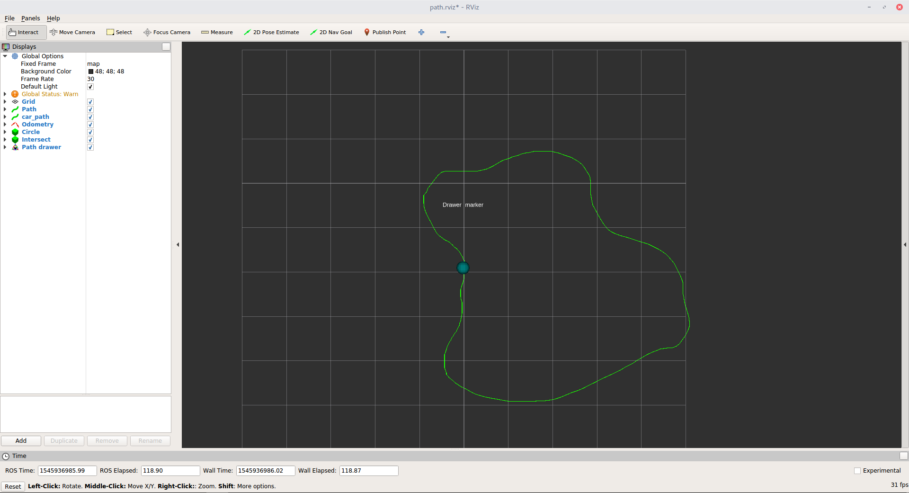
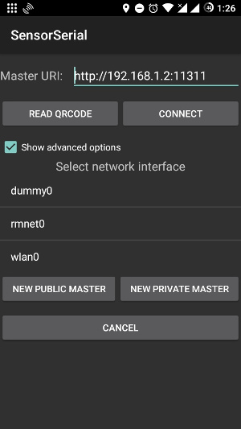
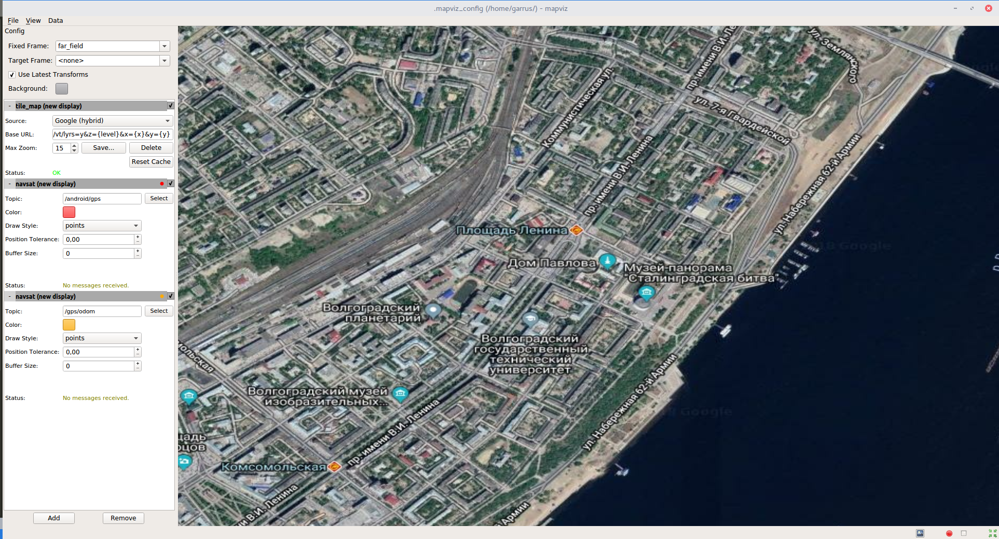

# ROS jetson_car

Пакет ROS с основной функциональностью.
 
Реализованные возможности:
- управление двигателями 
- удаленное управление с помощью джойстика
- движение по заданной траектории

## Ноды

### motors\_driver\_node
Осуществляет управление двигателями. Принимает команды управления и передает их микроконтроллеру.

Принимаемые топики:
- `/motors_commands` ([jetson_car/MotorsControl](msg/MotorsControl.msg)) - сырые команды управления двигателями (значение ШИМ для каждого двигателя)

### joy\_to\_motors\_node
Принимает сообщения от джойстика и преобразует их в сообщения для управления двигателями. Ось Y(1) - линейная скорось, ось Z(2) - вращение.

Принимаемые топики:
 - `/joy` ([sensor_msgs/Joy](http://docs.ros.org/melodic/api/sensor_msgs/html/msg/Joy.html)) - команды управления от джойстика

Публикуемые топики:
 - `/motors_commands` ([jetson_car/MotorsControl](msg/MotorsControl.msg)) - сырые команды для двигателей

Параметры:
 - `~max_pwm` (default: 15) - значение ШИМ, соответствующее максимуму команды от джойстика. Команды в интервале [-1; 1]
 - `~is_loop` (default: false) - если установлено, то последняя команда будет постоянно публиковаться, даже если новые от джойстика не поступают.
   Это нужно для более удобного управления с джойстика вручную, потому что на уровне STM32 происходит авто-отключение моторов, если команды
   не поступают в течении некоторого времении (300 мс)

**ВНИМАНИЕ TODO:** Это лучше переделать в более общепринятый для ROS вариант с использованием `geometry_msgs/Twist` и [teleop_twist_joy](http://wiki.ros.org/teleop_twist_joy)

Алсо, коэффициент ограничения на ШИМ здесь, плюс еще есть коэффициенты в `pth_mover_node`, все это делает управление менее очевидным. Возможно, не лучшая мысль. 

### odometry\_logger\_node
Функции:
 - Логгирует различные данные в формате iFrund:
    - Траектория по SLAM в отдельный файл
    - Траектория по GPS в отдельный файл
    - Вся одометрия (положение, углы Эйлера, кватернион) по SLAM в отдельный файл
 - Перепубликовывает получаемую одометрию в виде `nav_msgs/Path`, чтобы красиво отображать в RViz. **[УСТАРЕЛО]** zed-wrapper сам прекрасно умеет это делать

Принимаемые топики:
- `/zed/pose` ([geometry_msgs/PoseStamped](http://docs.ros.org/lunar/api/geometry_msgs/html/msg/PoseStamped.html)) - одометрия
- `/odometry/gps` ([nav_msgs/Odometry](http://docs.ros.org/melodic/api/nav_msgs/html/msg/Odometry.html)) - положение по GPS в той же С.К., что и одометрия от SLAM

Публикуемые топики:
- `/real_path` ([nav_msgs/Path](http://docs.ros.org/melodic/api/nav_msgs/html/msg/Path.html)) - **[УСТАРЕЛО]** путь, построенный на основе одометрии

Параметры:
- `~is_publish_path` (default: false) - перепубликовывать одометрию в формате `nav_mgsgs/Path`
- `~is_log_gps` (default: false) - логгировать ли GPS в файл
- `~is_log_path` (default: false) - логгировать ли одометрию (по SLAM) в файл
- `~logs_directory` - директория, куда сохранять логи. Этот параметр обязательный, если `is_log_gps` или `is_log_path` указаны

Логи сохраняются в формате iFrund в директории, указанной в параметре `logs_directory`:
 - `dir/log_Y.m.d_H.M.S_trajectory.txt` - траектория по SLAM
 - `dir/log_Y.m.d_H.M.S_gps.txt` - траектория по GPS
 - `dir/log_Y.m.d_H.M.S_full.txt` - полная одометрия (X,Y,Z, Yaw, Pitch, Roll, кватернион) по SLAM от времени

Подробнее о работае с GPS см. 

### path\_pub\_node
Считывает траекторию из файла и публикует ее

Публикуемые топики:
- `/path` ([nav_msgs/Path](http://docs.ros.org/melodic/api/nav_msgs/html/msg/Path.html)) - считанная траектория

Параметры:
 - `~path_file` (обязательный) - путь к iFrund-файлу с траекторией

### path\_drawer\_node
Позволяет рисовать траекторию непосредственно в RViz и сохранять ее в iFrund-файл



Публикуемые топики:
- `/path` ([nav_msgs/Path](http://docs.ros.org/melodic/api/nav_msgs/html/msg/Path.html)) - считанная траектория

Параметры:
- `~path_directory` - директория для сохранения нарисованных траекторий. Если не указано, траектории не будут сохранятся

### path\_mover\_node
Осуществляет движение по заданной траектории

Принимаемые топики:
 - `/zed/odom` ([nav_msgs/Odometry](http://docs.ros.org/melodic/api/nav_msgs/html/msg/Odometry.html)) - одометрия
 - `/path` ([nav_msgs/Path](http://docs.ros.org/melodic/api/nav_msgs/html/msg/Path.html)) - желаемая траектория

Публикуемые топики:
 - `/joy` ([sensor_msgs/Joy](http://docs.ros.org/melodic/api/sensor_msgs/html/msg/Joy.html)) - команды управлеия


В общем, это самая главная магия. Там есть еще куча магических параметров, которые я не стал выносить в rosparam. И вообще, это отстой и надо
переделать в нормальный матанистический Model Predictive Control. 

## launch-файлы
Подготовлен ряд launch-файлов для облегчения запуска различных задач в различных комбинациях. Основные:
 - ручное управление с помощшью джойстика и стриминг видео со встроенной камеры
 - движение по траектории

### joystic\_jetson.launch
Ручное управление с помощью джойстика + трансляция видео со встроенной CSI-камеры. Запускается на Jetson

Args:
- `max_pwm` (default: 15) - максимальное значение ШИМ
- `is_stream` (default: false) - включение видеотрансляции
- `control_pc` - адрес хоста, на который нужно передавать видео. Этот параметр обязательный, если включена трансляция `is_stream:=true`
 
### joystick\_host.launch
Клиент управления с помощью джойстика. Запускается на ПК

Args:
 - `dev` (default: `/dev/input/joy0`) - устройство джойстика
 - `is_stream` (default: false) - принимать видотрансляцию
 
### path\_move\_jetson.launch
Движение по траектории. Запускается на Jetson.
Запускаемые ноды (в различных комбинациях):
 - zed_wrapper
 - motors_driver_node
 - joy_to_motores_node
 - [Опционально] path_pub_node
 - [Опционально] odometry_logger_node
 - [Опционально] path_mover_node

Parameters:
 - `max_pwm` (default: 15) - максимальное значение ШИМ
 - `run_now` (default: true) - запускать ноду движения (для удобства отладки). Скорее всего, устарело, потому что теперь автоматическая остановка на уровне контроллера
 - `path_file` - путь к iFrund-файлу с траекторией. Если не указан, `path_pub_node` запущен не будет, надо будет кому-нибудь опубликовать путь
 - `is_publish_path` (default: false) - [см. odometry_logger_node](#odometry\_logger\_node)
  - `is_log_path` (default: false) - ...
  - `logs_directory` (default: ..jetson_car/logs) - ...
 
### path\_move\_host.launch
Движение по траектории. Запускается на ПК. 
Запускаемые ноды (в различных комбинациях):
 - RViz для визуализации
 - [Опционально] path_pub_node
 - [Опционально] path_drawer_node
 - [Опционально] odometry_logger_node

Args:
  - `is_draw_path` (default: false) - рисовать траекторию непосредственно в RViz
  - `path_directory` (default: jetson_car/logs) - сохранять нарисованную траекторию в файл в формате iFrund
  - `path_file` - открывать траекторию из указанного iFrund-файла
  - `is_publish_path` (default: false) - [см. odometry_logger_node](#odometry\_logger\_node)
  - `is_log_path` (default: false) - ...
  - `logs_directory` (default: false) - ...

  **Примечание:** должен быть выбран либо `is_draw_path`, либо `path_file`

# Мини-гайд
### Подготовка и настройка 
Для работы ROS на двух компьютерах (Jetson и хост), требуется соблюдение ряда требований:
 - хост и джетсон должны пинговать друг друга **по доменному имени**. Если имена не резолвятся, необходимо добавить в hosts
 - на хосте установить переменную окружения `ROS_MASTER_URI`:
 ```bash
 export ROS_MASTER_URI=http://tegra-ubuntu:11311
 ```

Для удобства рекомендуются [скрипт](.jetson_ros.sh), упрощающий эту задачу. Для удобства рекомендуется добавить в `~/.bashrc`:

```bash
...
# setup ros for jetson
alias jetson_ros='source ~/path/to/script/.jetson_ros.sh'
```

После этого устанавливать `ROS_MASTER_URI` можно сделать следующим образом:
```bash
$ jetson_ros
```

### Дистанционное управление с помощью джойстика
#### С видеотрансляцией:
Jetson:
```bash
$ roslaunch jetson_car joystick_jetson.launch is_stream:=true control_pc:=host_name
```

Host:
```bash
$ jetson_ros
$ roslaunch jetson_car is_stream:=true
```

### Движение по траектории
#### Траектория на хосте, логгирование на джетсоне
Наверное, это самый удобный вариант. Не надо перекидывать траекторию на джетсон. Также не нужен постоянный коннект к джетсону, так  что можно проводить
эксперименты на большой площади, и если машинка уедет и wifi не будет работать/будет работать плохо, то все данные всё равно залоггируются. А траектория
публикуется только один раз, он ее принимает и сохраняет.

Jetson:
```bash
$ roslaunch jetson_car path_move_jetson.launch is_log_path:=true
```

Host:
```bash
$ jetson_ros
$ roslaunch jetson_car path_move_host.launch path_file:=/path/to/trajetory.txt
```

#### Рисование траектории на хосте, логгирование на джетсоне
При рисовании траектории удобнее будет запустить `path_mover_node` отдельно. Иначе машинка сразу начнет ехать, как только будет нарисован хотя бы маленький
кусочек траеткории.

Jetson:
```bash
$ roslaunch jetson_car path_move_jetson.launch is_log_path:=true run_now:=false
```

Host:
```bash
$ jetson_ros
$ roslaunch jetson_car path_move_host.launch is_draw_path:=true
```

После рисования линии, снова на джетсоне:
```bash
rosrun jetson_car path_mover_node.py
```

### Логгирование ZED + GPS
**ВНИМАНИЕ: Экспериментальня возможность**

На текущий момент никакого нормального GPS нет, поэтому применяется костыль с подключением телефона. Для этого используется программа [ros_android_sensors](https://github.com/yycho0108/ros_android_sensors). [Скачать APK](../docs/sensor_serial-debug.apk).



1. Ввести IP-адрес ROS-мастера (это jetson)
2. Выбрать интерфейс wlan0
3. Connect

Jetson:
```bash
$ roslaunch jetson_car gps_test_jetson.launch
```
Аргументы:
 - `is_log_gps` (default: true) - логгировать GPS в файл
 - `is_log_path` (default: true) - логгировать одометрию с zed в файл

**Примечание:** также есть параметры `svo_recording`, `svo_recording_path`. Я пытался модифицировать zed_wrapper, чтобы он мог 
сохранять все данные с zed в свой формат SVO. Не помню, смог или нет.


Host (RViz и MapViz для визуализации)
```bash
$ jetson_ros
$ roslaunch jetson_car gps_test_host.launch
```

Важная информация содержится в лаунч-файле `include/_gps_converter.launch`. Там настраивается нода `navsat_transform` из пакета `robot_localization`. 
Этот пакет содержит много различных возможностей, таких как фильтры Калмана. Больше информации: [документация](http://docs.ros.org/melodic/api/robot_localization/html/index.html#).
Также важная информация о спецификации систем координат в ROS: [REP105](http://www.ros.org/reps/rep-0105.html).

Нода `navsat_transform` преобразует координаты GPS ([sensor_msgs/NavSatFix](http://docs.ros.org/melodic/api/sensor_msgs/html/msg/NavSatFix.html)) в
одометрию ([nav_msgs/Odometry Message](http://docs.ros.org/api/nav_msgs/html/msg/Odometry.html)) в системе координат ROS (world frame, согасно REP105 это map).
Также может обратно преобразовывать одометрию робота (например, от SLAM, в нашем случае от zed-камеры) обратно в координаты GPS. Таким образом в положение
по SLAM и положение по GPS можно выводить рядом, в одной и той же С.К., как в GPS, чтобы отображать на карте, так и в map, чтобы отображать в RViz, 
логгировать или еще что-нибудь.

Начальное смещение робота относительно GPS UTM frame определяется при первом получении GPS.

**ВНИМАНИЕ:** для корректного преобразования необходимо помимо смещения робота, необходимо знать угол поворота относительно С.К. GPS. По-идее для этого
нода `navsat_transform` подписывается на данные инерциальной системы навигации ([sensor_msgs/Imu Message](http://docs.ros.org/api/sensor_msgs/html/msg/Imu.html)),
которые вместе с GPS получаются от телефона. В `_gps_converter.launch` есть параметр `yaw_offset`, который установлен в pi/2. Это определено методом 
научного тыка, чтобы согласовать нули gps и imu андроида.
Также есть параметр магнитного наклонения, потому что компас не точно на север указывает. Хотя, может быть android уже сам все преобразует. 
Я же говорил, что это пока сырое. 


#### MapViz
[MapViz](https://github.com/swri-robotics/mapviz) - это кривой и глючный аналог RViz для отображения данных на карте. 



Установка:
```bash
sudo apt-get install ros-$ROS_DISTRO-mapviz ros-$ROS_DISTRO-mapviz-plugins ros-$ROS_DISTRO-tile-map ros-$ROS_DISTRO-multires-image
```

Прежде всего, его нужно настроить. В отличие от RViz, ему, кажется, нельзя указать имя файла конфига при помощи аргументов в launch-файле. 
Правильный конфиг, в котором настроено отображение карты Google Maps и траектории по одометрии и GPS расположен [тут](rviz/odom_gps.mvc). Есть два стула:
 - каждый раз открывать этот конфиг вручную в MapViz
 - скопировать в домашнюю директорию с именем `.mapviz_config`

##### О настройке карты
По-умолчанию MapViz не умеет отображать нормальные карты (например, GoogleMaps), а только неточное и медленное нечто. Но ему в качестве источника карт 
можно указать любой WMTS источник. WMTS (Web Map Tile Service) - стандартный протокол для карт. Его поддерживает в том числе и Google Maps.

Пример Base URL для MapViz:
```
http://mt1.google.com/vt/lyrs=y&z={level}&x={x}&y={y}
```
level, x, y подставляется самим MapViz чтобы получить URL тайла, в зависимости от координат и разрешения. Аргументом `lyrs` можно выбирать тип карты:
- h = roads only
- m = standard roadmap
- p = terrain
- r = somehow altered roadmap
- s = satellite only
- t = terrain only
- y = hybrid

В представленном конфиге уже сохранены настройки для гибридной и обычной карты. Приятная особенность MapViz - он кэширует тайлы. Первый раз просмотр новой
местности или на новом масштабе чуть медленный, но потом они будут сохранены и могут быть использованы даже без интернета.